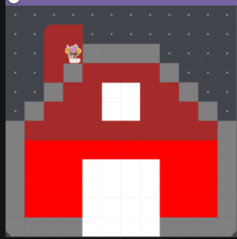

# Unit-1-asphalt-art-project
Unit 1 project about a digital pixel barn.
By: Shenaya De Zilwa
# Unit 1 - Asphalt Art

## Introduction

Cities use asphalt art to improve public safety, inspire their residents and visitors, and brighten communities. Your goal is to create asphalt art to revitalize The Neighborhood and bring the community together with the help of the Painter. The point of my project is to create a barn as many animals live in barns and get taken care of. 

## Requirements

Use your knowledge of object-oriented programming, algorithms, the problem solving process, and decomposition strategies to create asphalt art:
- **Create a new subclass** – Create at least one new subclass of the PainterPlus class that is used for a component of the asphalt art design.
- **Plan an algorithm** – Use the problem solving process and decomposition strategies to plan an algorithm that incorporates a combination of sequencing, selection, and/or iteration.
- **Write a method** – Write at least one method in a PainterPlus subclass that contributes to a component of the asphalt art design.
- **Document your code** – Use comments to explain the purpose of the methods and code segments.

## Notes: Neighborhood & Painter Class

This project was created on Code.org's JavaLab platform using the built-in Neighborhood GUI output. To test and edit this project you must build in Code.org's JavaLab with the Neighborhood GUI enabled. For reference to the Painter class documentation, [you can read more here.](https://studio.code.org/docs/ide/javalab/classes/Painter)

## Output:
Sketch!!

Result!!

## Reflection

1. Describe your project.

My project is about a my barn painter painting a barn because I love animals, and you can always find a farm animal in a barn. 

2. What are two things about your project that you are proud of?

Two things in this project that I'm most proud of was that I was able to make the exact shape I wanted my project to be, and my project doesn't show any errors. 

3. Describe something you would improve or do differently if you had an opportunity to change something about your project.

Somethign that I would improve is the amount of methods I used if I were to do this project again because I wanted to make more while-loops to replace the amount of methods I used, but I didn't know where to put them. 

4. How is this project related to STEAM (Science, Technology, Engineering, Art, and Mathematics)? Provide explicit examples from the project and details as possible. 

This project is related to STEAM because we are using art to make the pixel image of what we want. To start, we illustrated the object we wanted to use, then we used Technology to code our painter to paint the object that we wanted.

5. What SLOs did you demonstrate during completing this project?

Some examples of SLOs that I demonstrated while completing this project was critical thinking because I needed to design methods to write my project. I also used critical thinking to fix the errrors in my code when I experienced them. Another example of the SLOs that I demonstrated during this project was the responsible community members because I showed integrity into creating my project without using AI integrated into my project, I just used it to check my work, and I mostly did the project by myself using abit of help from my friends. I showed the SLOs responsible community member because I was honest with my work, and I was being a critical thinker. 